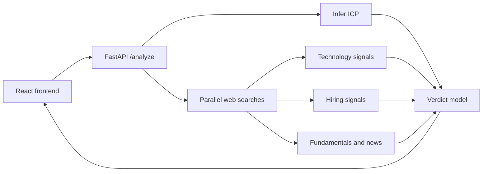

# GTM Agent

GTM Agent is a sales intelligence demo for founders, GTM engineers, and account executives. Enter what you sell and a target company; it searches public web evidence, compares the signals with an inferred ICP, and returns a `PURSUE`, `WATCH`, or `DEPRIORITIZE` recommendation with confidence, citations, and failed-source warnings.

## Architecture



## Verdict rules

The model evaluates only ICP fields that were inferred with a value. It compares headcount and funding stage, checks named technology and hiring signals, and uses revenue or funding as a budget proxy. Missing or failed sources must be called out and lower confidence; they are never treated as negative evidence.

## Local development

Set `ANTHROPIC_API_KEY` in `.env`, then run:

```bash
pip install -r requirements.txt
uvicorn backend.app:app --reload --port 8000
cd frontend && npm install && npm run dev
```

## Deployment

Run the backend behind your host's proxy with forwarded headers enabled, so the per-client rate limit sees real visitor IPs instead of the proxy's:

```bash
uvicorn backend.app:app --host 0.0.0.0 --port $PORT --proxy-headers --forwarded-allow-ips='*'
```

Set `ALLOWED_ORIGINS` to the exact frontend origin, and `VITE_API_BASE_URL` in the frontend deployment. `ANTHROPIC_SONNET_MODEL` and `ANTHROPIC_HAIKU_MODEL` override the default models (`claude-sonnet-5` and `claude-haiku-4-5`).

## Tests

```bash
pytest
```

## Known limitations

- Search quality depends on Anthropic web-search availability and public company information. An analysis can take a minute or more; each web search is capped at three queries and 90 seconds, and a search that times out is reported as an unavailable source rather than failing the verdict.
- Technology and hiring signals are web evidence, not direct BuiltWith or careers API data.
- The demo uses one shared API key, so production deployments should add authentication, durable rate limiting, usage budgets, and secret management.

