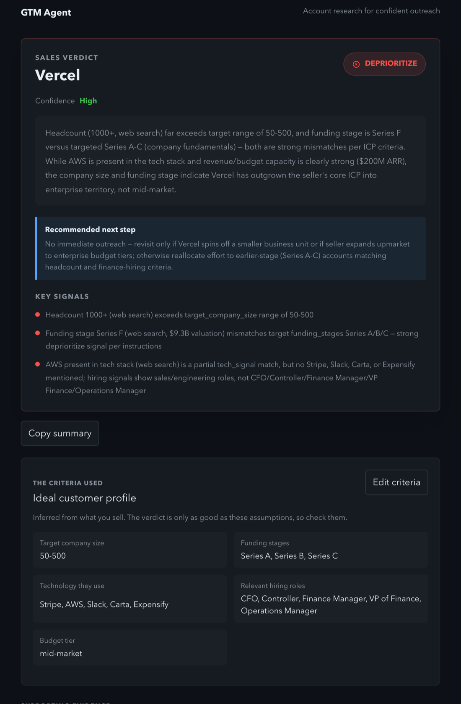
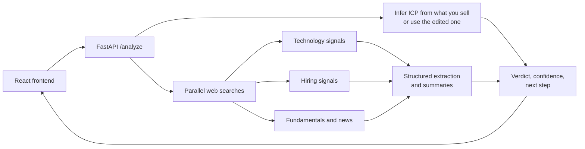

# GTM Agent

**Should your sales team go after this account?** Enter what you sell and a target company. GTM Agent infers your ideal customer profile, researches the company on the public web, and returns a **Pursue / Watch / Deprioritize** verdict with a confidence level, the evidence behind it, and a recommended next step.

**Live demo:** [gtm-sales-agent.vercel.app](https://gtm-sales-agent.vercel.app)



## What a seller gets

- **A verdict they can defend.** Every verdict cites the evidence that drove it: headcount, funding stage, the tools the company uses, the roles it is hiring for, and recent news, each with links to sources.
- **A next step specific to the account.** Which role to contact and what to open with, what to verify first, or what would make the account worth revisiting.
- **Visible, editable assumptions.** The ideal customer profile inferred from "what you sell" is shown with the result. If an assumption is wrong, edit it and rerun; the verdict is judged against your criteria, not a hidden guess.
- **Honest uncertainty.** If a source can't be retrieved, the page says so and confidence drops. A missing source is never treated as negative evidence.
- **Built for daily use.** It remembers what you sell, keeps your recent account reviews, and copies a summary for your CRM or Slack in one click.

The landing page is written for founders, SDRs, AEs, and RevOps: enter what you sell, the account, and optionally its website. It explains the workflow, shows the evidence-first result format, and keeps recent reviews in the browser. Company websites help disambiguate accounts with similar names.

Saved landing-page examples live in `frontend/src/examples/` when they have been recorded. To create or refresh them, set `ANTHROPIC_API_KEY` and run `python scripts/record_examples.py`. This calls the live Anthropic pipeline and incurs API charges, so it is intentionally not part of the normal test or build steps. Until examples are recorded, the landing page shows the real result screenshot from `docs/result.png`.

If the shared demo account has no Anthropic credits, live research returns a calm paused state with a link to the saved example instead of a generic server error. Network failures explain that the server may be waking and offer a retry.

## How it works



1. **ICP inference.** Claude Haiku turns the product description into target company size, funding stages, technology signals, hiring signals, and budget tier.
2. **Evidence gathering.** Four web searches run in parallel (technology, hiring, company fundamentals, recent news) using Claude Sonnet with the web search tool. Haiku extracts structured fields such as headcount, funding stage, and open roles.
3. **Verdict.** Sonnet compares the evidence against each specified ICP criterion and returns a decision, reasoning, key signals, a confidence level, and a next step, which the backend parses into structured fields.

A typical analysis takes 30 to 60 seconds.

## Engineering notes

- **Measured, not assumed.** The newer dynamic-filtering web search tool was benchmarked against the basic one on this app's queries. The basic tool answered in about 21s versus 34s to a timeout, used about 5x fewer input tokens, and returned fuller text, so the app uses it. In testing, the switch cut a full analysis from 130s to 37s.
- **Bounded latency.** Each search is capped at three queries and 90 seconds with no retries. A search that fails or times out is reported as an unavailable source instead of failing the whole verdict.
- **Validated input.** An edited ICP is a typed schema with per-field length and item limits, so user-supplied criteria can't bloat or hijack the verdict prompt.
- **Robust parsing.** The verdict parser tolerates the formatting models actually produce (bold headings, `*` bullets, "Medium." or "[HIGH]" confidence) and rejects responses missing a decision or reasoning instead of silently defaulting.
- **Abuse limits for a public demo.** Per-client sliding-window rate limiting, request size limits, and no internal error details in API responses.
- **Tests.** The pytest suite covers tool responses without citations, paused search turns, failed sources, verdict parsing edge cases, ICP validation, and rate limiting.

## Run locally

Set `ANTHROPIC_API_KEY` in `.env`, then:

```bash
pip install -r requirements.txt
uvicorn backend.app:app --reload --port 8000
cd frontend && npm install && npm run dev
```

Open http://localhost:3000. Run the tests with `pytest`.

## Deployment

The backend runs on Render and the frontend on Vercel. Start the backend with forwarded headers enabled so rate limiting sees real visitor IPs rather than the proxy's:

```bash
uvicorn backend.app:app --host 0.0.0.0 --port $PORT --proxy-headers --forwarded-allow-ips='*'
```

Set `ALLOWED_ORIGINS` on the backend to the exact frontend origin, and `VITE_API_BASE_URL` on the frontend to the backend URL. `ANTHROPIC_SONNET_MODEL` and `ANTHROPIC_HAIKU_MODEL` override the default models (`claude-sonnet-5` and `claude-haiku-4-5`).

## Known limitations

- Evidence comes from public web search, so quality depends on what is published about a company. Technology and hiring signals are web evidence, not direct BuiltWith or applicant-tracking-system data.
- Company names can be ambiguous; there is no disambiguation step yet.
- One company per analysis; there is no bulk account list yet.
- Recent reviews are stored in the browser only.
- The demo uses one shared API key. A production deployment would add authentication, durable rate limiting, and usage budgets.
