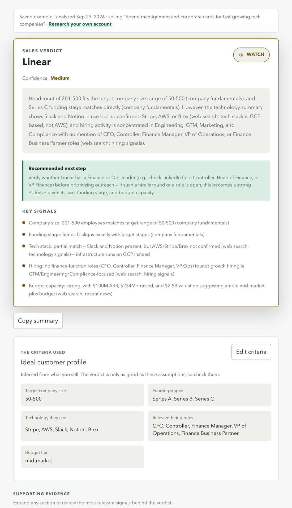

# GTM Agent

**Should your sales team go after this account?** Enter what you sell and a target company. GTM Agent researches the company on the public web and returns a **Pursue / Watch / Deprioritize** verdict with a confidence level, the evidence behind it, and a recommended next step.

**Live demo:** [gtm-sales-agent.vercel.app](https://gtm-sales-agent.vercel.app)



## What you get

- **A verdict you can defend.** Every verdict cites the evidence behind it: company size, funding, the tools the company uses, the roles it is hiring for, and recent news, with links to sources.
- **A next step for the account.** Who to contact and what to open with, what to verify first, or what would make the account worth revisiting.
- **Assumptions you can see and change.** The customer profile inferred from what you sell is shown with every result. Edit it and rerun if it's off.
- **Honest uncertainty.** If a source can't be found, the result says so and confidence drops.
- **Built for daily use.** It remembers what you sell, keeps your recent reviews, and copies a summary for your CRM or Slack in one click.

## How it works

1. **Describe what you sell.** GTM Agent turns it into clear buying criteria.
2. **It researches the company** across the public web: company facts, technology, hiring, and recent news.
3. **It weighs the evidence against your criteria** and explains its verdict.

Built with React, FastAPI, and Claude. A typical analysis takes under a minute.

## Engineering highlights

- **Measured decisions.** Search approaches were benchmarked on real queries before choosing one, which cut a full analysis from about two minutes to under one.
- **Fails gracefully.** A slow or failed source is reported as missing instead of breaking the verdict.
- **Validated input** for everything a user can edit, and **tested** parsing, validation, and error handling.

## Run locally

Add an Anthropic API key to `.env` as `ANTHROPIC_API_KEY`, then:

```bash
pip install -r requirements.txt
uvicorn backend.app:app --reload --port 8000
cd frontend && npm install && npm run dev
```

Open http://localhost:3000. Run the tests with `pytest`.

## Limitations

- Evidence comes from public web search, so results depend on what is published about a company.
- One company per analysis; bulk account lists aren't supported yet.
- Recent reviews are stored in your browser only.
