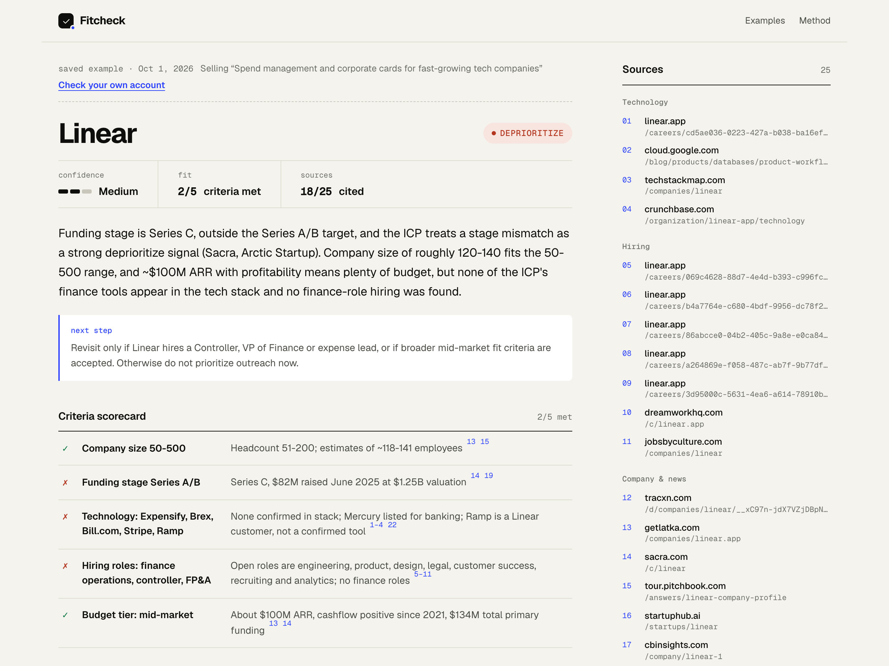

# Pursue

**Should your sales team go after this account?** Enter what you sell and a target company. It researches the company on the public web and tells you whether to **pursue, watch, or deprioritize** it, with a confidence level, the evidence behind it, and a recommended next step.

**Live demo:** [gtm-sales-agent.vercel.app](https://gtm-sales-agent.vercel.app)



## What you get

- **A verdict you can defend.** Every verdict cites the evidence behind it: company size, funding, the tools the company uses, the roles it is hiring for, and recent news, with links to sources.
- **A next step for the account.** Who to contact and what to open with, what to verify first, or what would make the account worth revisiting.
- **Assumptions you can see and change.** The customer profile inferred from what you sell is shown with every result. Edit it and rerun if it's off.
- **Honest uncertainty.** If a source can't be found, the result says so and confidence drops.
- **Built for daily use.** It remembers what you sell, keeps your recent reviews, and copies a summary for your CRM or Slack in one click.

## How it works

1. **Describe what you sell.** Pursue turns it into clear buying criteria.
2. **It researches the company** across the public web: company facts, technology, hiring, and recent news.
3. **It weighs the evidence against your criteria** and explains its verdict.

Built with React, FastAPI, and Claude. A typical analysis takes under a minute.

## Engineering highlights

- **Measured decisions.** Search approaches were benchmarked on real queries before choosing one, which cut a full analysis from about two minutes to under one.
- **Fails gracefully.** A slow or failed source is reported as missing instead of breaking the verdict, and a failed extraction is never mistaken for negative evidence.
- **Checked confidence.** The model's confidence is capped in code by how many sources failed and how many ICP criteria have no evidence behind them.
- **Cited claims.** Every signal and criterion carries numbered source links, and the verdict card shows a criteria match table.
- **Structured outputs.** Verdict and extractors use JSON-schema outputs, so there is no regex parsing of model text.
- **Cheap reruns.** Evidence is cached for six hours per company, so re-running with edited criteria only regenerates the verdict (1 LLM call and about 7s, vs. 8 calls and about 20s fresh).
- **Validated input** for everything a user can edit, and **tested** parsing, validation, and error handling.

## Run locally

Add an Anthropic API key to `.env` as `ANTHROPIC_API_KEY`, then:

```bash
pip install -r requirements.txt
uvicorn backend.app:app --reload --port 8000
cd frontend && npm install && npm run dev
```

Open http://localhost:3000. Run the tests with `pytest`.

**Deploying behind a proxy.** Set `TRUSTED_PROXY_HOPS` to the number of reverse proxies in front of the API (for example `1` on most hosts) so the per-client rate limit keys on the real client IP from `X-Forwarded-For` instead of the proxy's address. Leave it unset when the API is exposed directly. Workspace-scoped API keys (`sk-ant-api03-…`) need nothing extra; a user-scoped key (`sk-ant-usr-…`) also needs `ANTHROPIC_WORKSPACE_ID`, sent as the `anthropic-workspace-id` header. Model IDs are overridable with `ANTHROPIC_SONNET_MODEL` and `ANTHROPIC_HAIKU_MODEL`.

## Evaluating verdict quality

`python scripts/eval_verdicts.py` runs 15 labeled cases (`scripts/eval_cases.json`: three seller products against five companies each, with the set of defensible verdicts for each) and reports agreement with the expected set, decision stability across repeat runs, citation coverage, p50/p95 latency, and token cost per run from the telemetry logs. The expected sets are the author's judgement, not ground truth. It makes paid API calls (about $0.22 per fresh run) and writes `scripts/eval_results.json`.

Results from the Oct 1, 2026 run (15 cases, 3 runs each; repeat runs reuse the cached research, so stability measures the verdict step):

| Metric | Result |
|---|---|
| Agreement with the expected verdict set | 11 / 15 (73%) |
| Stability (same decision on all 3 runs) | 13 / 15 (87%) |
| Citation coverage (signals and criteria citing a source) | 100% |
| Latency, fresh run | p50 24.4s · p95 26.0s |
| Cost per fresh run | $0.22 (8 LLM calls, web search fees excluded) |

All four misses were deprioritized where a softer verdict was expected, and all four are well-funded, later-stage companies (Supabase, Vercel, Retool, Linear) checked against an inferred ICP that targets Series A/B. The verdict prompt treats a funding-stage mismatch as a strong deprioritize signal, so the model is applying the rule as written; the open question is whether that rule, or the expected labels, is too strict. Both unstable cases flip between Deprioritize and Watch on that same boundary. That is the next thing to tune, measured against this eval.

## Limitations

- Evidence comes from public web search, so results depend on what is published about a company.
- One company per analysis; bulk account lists aren't supported yet.
- Recent reviews are stored in your browser only.
